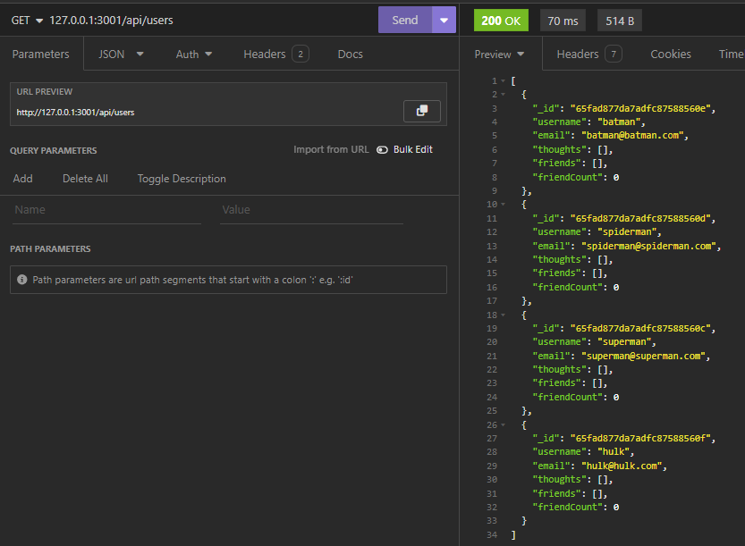

# Social Network API Mongoose

## Description

This Express application is powered by the NoSQL database MongoDB. This platform enables users to share their thoughts, react to others' posts, and connect with friends seamlessly. You can effortlessly manage user accounts, post updates, interact with friends, and express reactions to various thoughts.

## Table of Contents
- [Installation](#installation)
- [Usage](#usage)
- [License](#license)
- [Contributing](#contributing)
- [Tests](#tests)
- [Questions](#questions)
- [Screenshots](#screenshots)
- [Demonstration Video](#video)
- [GitHub Link](#github-link)

## Features

CRUD operations for user and thought management. 
Ability to add and remove friends. 
Capability to post reactions to thoughts. 
Database seeding with sample data for testing and demonstration.

## Technologies Used
Node.js 
Express.js 
MongoDB with Mongoose on top 
Insomnia for API testing

## Setup and Installation
Clone the repository: `git clone https://github.com/harrymac1972/social_network_API_mongoose` 
Navigate to the project directory: `cd social_network_API_mongoose` 
Install dependencies: `npm install` 
Seed the database with initial data: `npm run seed` 
Start the server: `npm run start` 

## License
This application is licensed by: [MIT](https://opensource.org/licenses/MIT)

## Contributing
You may 'fork' the project in the github repository.

## Tests
n/a

## Questions
If you have any questions, please contact:
-- (https://github.com/harrymac1972)
-- harrymac1972@gmail.com.

## Screenshots

## Demonstration Video
<a href="https://drive.google.com/file/d/1KCmuKKYqAjt_ykB6BZy6TcAgEULKJnzC/view">Video Walkthrough</a>

## GitHub Link
<a href="https://github.com/harrymac1972/social_network_API_mongoose">Social Network API Mongoose on Github</a>

## Heroku Link
n/a

## Credits

Mongoose Documentation: For detailed information on Mongoose schema design and queries. [Mongoose Docs](https://mongoosejs.com/docs/guide.html)

Net Ninja Tutorial: Full Node.js course watched but extra attention to Mongoose video (#9). [Net Ninja - Node JS Crash Course](https://www.youtube.com/watch?v=zb3Qk8SG5Ms&list=PL4cUxeGkcC9jsz4LDYc6kv3ymONOKxwBU)
